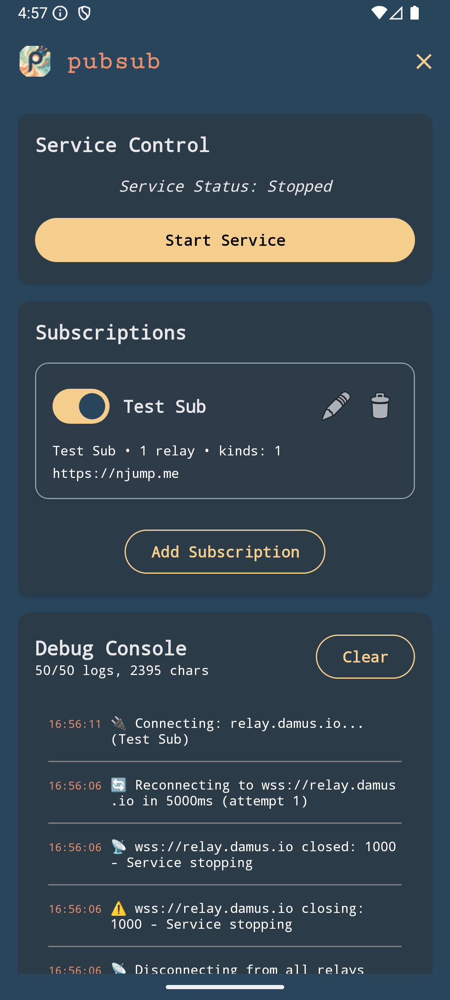
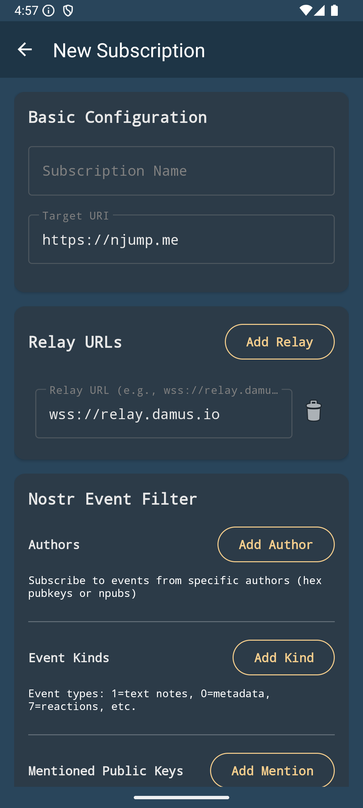

<div align="center">
  
  
  # pubsub
  
  **Keep your sleeping PWAs connected to the nostr fire-hose**
  
  [](https://android.com)
  [](https://kotlinlang.org)
  [](https://nostr.com)
</div>

## Features

- 🔗 **Persistent Connection**: Stay connected to relays in the background.
- 🎯 **Event Filtering**: Subscribe to events based on NIP-1 filters.
- 📱 **Custom Notifications**: Generate notifications with a custom call-back URI.
- 🌐 **App Registration**: Register subscriptions through `pubsub://` link.
- 🔋 **Battery Optimized**: Follows Android best practices for background services.

---

## Screenshots

<div align="center">
  
  
</div>

*From left to right: Main configuration screen, Subscription editor*

---

## Configuration

The app supports multiple subscription configurations:

1. **Subscription Name**: Descriptive name for the subscription.
2. **Target Device URI**: URI to forward events to (e.g., URL of your web app).
3. **Relay URLs**: One or more relays URLs (e.g., `wss://relay.damus.io`).
4. **NIP-1 Event Filters**: Nostr public key or custom filter to monitor.

The app supports deep link registration via the `pubsub://register` scheme for easy configuration from web applications.

---

## Development

### Project Structure

```
app/src/main/java/com/pubsub/
├── ui/                 # User interface components
│   ├── MainActivity.kt # Main configuration activity
│   ├── ConfigurationEditorActivity.kt # Subscription editor
│   └── adapters/       # RecyclerView adapters
├── service/            # Background service components
│   ├── PubSubService.kt # Main background service
│   └── BootReceiver.kt # Boot receiver for auto-start
├── nostr/             # Nostr protocol implementation
│   ├── NostrEvent.kt  # Event data model
│   ├── NostrFilter.kt # Filter data model
│   └── NostrMessage.kt # Message parsing utilities
├── data/              # Data models and management
│   ├── Configuration.kt # Subscription configuration
│   └── ConfigurationManager.kt # Configuration persistence
└── utils/             # Utility classes
    ├── PreferencesManager.kt # Settings management
    ├── UriBuilder.kt  # URI building utilities
    ├── NostrUtils.kt  # Nostr helper functions
    └── DeepLinkHandler.kt # Deep link processing
```

### Prerequisites

- Android Studio (Koala or later)
- Android SDK with API level 34
- Java 17+

### Development Build

1. Clone the repository
2. Open in Android Studio
3. Sync Gradle files
4. Build and run on device or emulator

### Release Build (Google Play Store)

1. Generate signing keystore:
   ```bash
   ./script/generate_keystore.sh
   ```

2. Update `app/build.gradle.kts` with your keystore details

3. Build release version:
   ```bash
   ./script/build_release.sh
   ```

4. Build beta version for testing:
   ```bash
   ./script/build_beta.sh
   ```

> See `docs/RELEASE_CHECKLIST.md` for complete Google Play Store preparation steps.

### Dependencies

- **OkHttp**: WebSocket client for Nostr connections
- **Gson**: JSON parsing for Nostr messages
- **AndroidX**: Modern Android UI and lifecycle components
- **Material Design Components**: Modern UI components
- **Kotlin Coroutines**: Asynchronous programming
- **Core Splash Screen**: Modern splash screen implementation

## Permissions

The app requires the following permissions:

- `INTERNET`: Network access for WebSocket connections
- `FOREGROUND_SERVICE`: Running persistent background service
- `FOREGROUND_SERVICE_DATA_SYNC`: Data synchronization service type
- `POST_NOTIFICATIONS`: Showing notifications (Android 13+)
- `RECEIVE_BOOT_COMPLETED`: Auto-starting service after reboot
- `WAKE_LOCK`: Maintaining connections during doze mode

All permissions are documented in the privacy policy and are essential for core functionality.

## License

This project is free and open source. It is intended for educational and development purposes. No warranty, no refunds.
